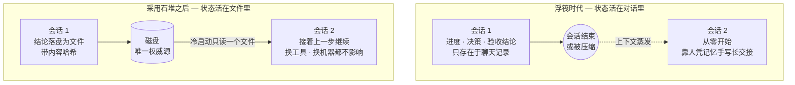
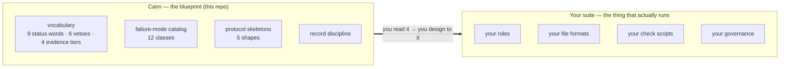
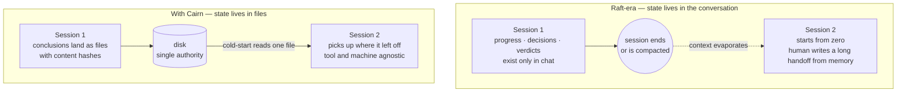

<p align="center">
  <picture>
    <source media="(prefers-color-scheme: dark)" srcset="assets/cairn-dark.svg">
    
  </picture>
</p>

<p align="center">
  <a href="LICENSE"></a>
  
  
</p>

<p align="center">
  <b><a href="#石堆--中文版">中文</a></b> · <b><a href="#cairn--english">English</a></b>
</p>

---

## 石堆 · 中文版

### 这是写给谁的

如果你用 AI 助手跑过一个**多角色、跨很多次对话**的项目——写代码、做研究、跑实验、审报告——你大概率撞过这几堵墙:

- 一次对话结束或被压缩,上下文就没了,只能靠人凭记忆重写一份很长的交接文档;
- 审计者、执行者、协调者……每个角色汇报都自创一套格式,交叉比对全靠人脑翻译;
- 某个文件到底算不算「最终版」,没有任何机制能回答,只能靠人记、靠人问;
- 换个工具、换台机器接着干,前面的进度等于从零讲起。

这些不是你团队独有的毛病。它们是**同一批结构性失败**,会在任何「状态活在对话里、而不是活在文件里」的工作方式中反复出现。石堆把它们编成目录,并给出每一类的修复方向。

> [!NOTE]
> **先说清一个词:「套件」**
>
> 本文里,**套件** = 你实际搭出来、真正在跑的那一整套东西:几个角色(人或 AI agent)、一批约定格式的文件、几个检查脚本、一份治理规则——合起来支撑一个跨越数周乃至数月、横跨很多次会话的项目。
>
> **石堆本身不是套件。石堆是教你怎么设计套件的图纸。**

### 石堆是什么

**石堆(Cairn)** 是一份**模式级架构规范**。它只回答一个问题:

> 一个多智能体、多会话的工作套件,需要什么样的词汇、什么样的骨架、什么样的纪律,才能在会话不断中断、执行工具不断更换的情况下,依然撑得住、依然认得清自己走到了哪一步?

如果你听说过 **The Twelve-Factor App**——那份文档不运行任何应用,只讲一个应用该具备哪十二种特质。石堆做的是同一件事,只是把对象从 Web 应用换成了「多智能体、跨会话的工作套件」。


这也是为什么它自称「框架」而不是「套件」:框架是元层,描述套件必须具备的**形状**;套件是你照着这个形状搭出来、真正在跑的**东西**。两者不矛盾,是两个层次。

### 它到底解决什么



### 石堆给你什么 · 你自己决定什么

| 石堆给你 | 你自己决定 |
|---|---|
| 状态描述该用哪套词汇,以及哪些词是禁用的 | 你的角色叫什么名字、有几个 |
| 哪 12 类失败会反复出现、每类的根因与修复方向 | 用哪个 AI 助手、哪套工具链 |
| 交接、冷启动文件、决策队列该是什么形状 | 日志用 JSON、YAML 还是纯文本 |
| 什么样的记录纪律能让证据经得起复核 | 检查脚本怎么写、跑在哪 |

一句话:石堆告诉你这些工件必须**做什么**,不管它们该**叫什么**、**怎么实现**。

### 这不是什么

- **不是一个套件**——这里没有应用,不能跑。它是**写下来的架构**:你读它、照它设计,而不是安装它、运行它。
- **不是工具集**——没有 `check` 二进制、没有生成器、没有状态文件。
- **不对你的命名和技术选型发表意见**——仓库里所有 `<system-name>` `<role>` `<suite>` 都是占位符,由你填。
- **不是承诺**——模式压缩的是经验,是否契合你的项目,由你判断。

### 阅读顺序

**先理解问题**

1. [`docs/01-what-is-a-raft-suite.md`](docs/01-what-is-a-raft-suite.md) — 定义 + 症状清单 *(待写)*
2. [`docs/02-signs-you-need-this.md`](docs/02-signs-you-need-this.md) — 自诊断清单 *(待写)*
3. [`docs/03-glossary.md`](docs/03-glossary.md) — **9 个状态词 + 6 个一票否决 + 4 个证据等级**
4. [`docs/04-failure-modes.md`](docs/04-failure-modes.md) — **12 类失败,模式级**

**准备动手设计**

5. [`docs/05-record-discipline.md`](docs/05-record-discipline.md) — 7 条立即可强制的规则 *(待写)*
6. [`docs/06-anti-patterns.md`](docs/06-anti-patterns.md) — 6 种不该建的形状 *(待写)*
7. [`docs/07-protocol-skeletons.md`](docs/07-protocol-skeletons.md) — **5 种骨架**(交接 · 冷启动 · 决策队列 · 角色 playbook · 限定范围复审)
8. [`docs/08-methodology.md`](docs/08-methodology.md) — 3 种可复用方法 *(待写)*

**准备落地实现**

9. [`docs/09-implementation-checklist.md`](docs/09-implementation-checklist.md) — 实现必须回答的问题清单 *(待写)*
10. [`UPGRADE-PATH.md`](UPGRADE-PATH.md) — 走出浮筏时代的方向,用问题写,不给答案 *(待写)*

**粗体的三份是本版已完整成稿的部分**;标注*(待写)*的会在后续 pass 中补齐。`templates/` 里是可直接抄的骨架,填 `<占位符>` 即可。

### 「浮筏时代」是什么意思

> 「浮筏时代」的套件是这样的:工作状态活在对话历史和人的记忆里,跨会话的连续性依赖于「有人还在这个房间里」。一旦会话结束,浮筏就散开了。

石堆是**浮筏时代出过什么问题**的目录,也是**下一次迭代必须长成什么形状**的目录。它到此为止,不规定下一次迭代具体该怎么做。

### 为什么叫「石堆」

在荒野里,石堆(cairn)是留给下一个走这条路的人的方向标——不是路本身、不是目的地、也不是地图,只是一个「有人走过,方向大约在这边」的标记。这份框架的定位与它一样:不告诉你套件该叫什么、长什么样、用什么工具;只告诉你,在浮筏时代这段荒野里,前面的人在哪几个坑摔过,又是怎么爬出来的。

### Non-goals

- 共识算法(与 Raft 共识算法无关)
- 多智能体编排平台
- LLM 提示工程
- 任何具体论文、项目或组织

### 许可 · 状态 · 迭代

Draft v0.1 · License **MIT** · 首次公开发布,后续持续迭代。

迭代规则见 `UPGRADE-PATH.md`。新内容尽量追加式落地;规则被撤销时保留在文件里,加删除线与日期备注,让 fork 的人能追踪变更。

### Origin

从多个独立工作流中反复出现的连续性与溯源模式蒸馏而来。项目特定的细节已被移除。

---

## Cairn · English

### Who this is for

If you've ever run a **multi-role project across many sessions** with an AI assistant — writing code, doing research, running experiments, auditing reports — you've probably hit these walls:

- A session ends or gets compacted, the context is simply gone, and a human has to rewrite a long recovery document from memory;
- Every role — auditor, executor, coordinator — invents its own report format, so cross-referencing runs on human translation;
- Whether a given file is "the final version" has no mechanical answer; it lives in someone's head;
- Switch tools or switch machines, and the accumulated progress has to be re-explained from scratch.

None of this is unique to your team. These are the **same structural failures**, and they recur in any way of working where state lives in conversation rather than in files. Cairn catalogs them and gives a repair direction for each.

> [!NOTE]
> **One word first: "suite"**
>
> In this document, a **suite** is the actual working system you build and run: a handful of roles (human or AI agent), a set of conventionally-formatted files, a few check scripts, a governance rule — together supporting a project that spans many sessions over weeks or months.
>
> **Cairn itself is not a suite. Cairn is the blueprint for designing one.**

### What Cairn is

**Cairn** is a **pattern-level architecture**. It answers exactly one question:

> What vocabulary, what skeletons, what discipline does a multi-agent, multi-session work suite need, so that it still holds together — and still knows where it is — as sessions keep ending and the execution tool keeps changing?

If you know **The Twelve-Factor App**: that document runs no application; it only states the twelve qualities an application should have. Cairn does the same thing, with web apps swapped out for multi-agent, multi-session work suites.



This is also why it calls itself a *framework* rather than a *suite*: the framework is the meta layer, describing the **shape** a suite must have; the suite is the actual running **thing** you build to that shape. Not contradictory — two different layers.

### What it actually fixes



### What Cairn gives you · What you decide

| Cairn gives you | You decide |
|---|---|
| The vocabulary state descriptions must use, and which words are banned | What your roles are called, and how many there are |
| The 12 recurring failure classes, each with root cause and repair direction | Which AI assistant and toolchain you use |
| The shape a handoff, cold-start file, or decision queue must have | Whether your log is JSON, YAML, or plain text |
| The record discipline that makes evidence survive review | How your check scripts are written and where they run |

In one line: Cairn tells you what these artifacts must **do** — never what they must be **called** or **how** to implement them.

### What this is NOT

- **Not a suite** — there's no application here, nothing to run. It's a **written architecture**: something you read and design against, not something you install or execute.
- **Not a toolkit** — no `check` binary, no generator, no state file.
- **Not opinionated about your naming or stack** — every `<system-name>`, `<role>`, `<suite>` in this repo is a placeholder for you to fill.
- **Not a promise** — patterns compress experience; whether they fit your project is your judgment.

### Reading order

**Understand the problem first**

1. [`docs/01-what-is-a-raft-suite.md`](docs/01-what-is-a-raft-suite.md) — definition + symptom list *(to be written)*
2. [`docs/02-signs-you-need-this.md`](docs/02-signs-you-need-this.md) — self-diagnosis checklist *(to be written)*
3. [`docs/03-glossary.md`](docs/03-glossary.md) — **nine status words + six one-vote-vetoes + four evidence tiers**
4. [`docs/04-failure-modes.md`](docs/04-failure-modes.md) — **twelve failure classes, pattern-level**

**Ready to design**

5. [`docs/05-record-discipline.md`](docs/05-record-discipline.md) — seven immediately-enforceable rules *(to be written)*
6. [`docs/06-anti-patterns.md`](docs/06-anti-patterns.md) — six shapes not to build *(to be written)*
7. [`docs/07-protocol-skeletons.md`](docs/07-protocol-skeletons.md) — **five skeletons** (handoff · cold-start · decision queue · role playbook · scoped reconsideration)
8. [`docs/08-methodology.md`](docs/08-methodology.md) — three reusable methods *(to be written)*

**Ready to implement**

9. [`docs/09-implementation-checklist.md`](docs/09-implementation-checklist.md) — questions your implementation must answer *(to be written)*
10. [`UPGRADE-PATH.md`](UPGRADE-PATH.md) — direction of travel past raft-era, in questions not answers *(to be written)*

**The three bolded files are fully drafted in this pass**; those marked *(to be written)* land in later passes. Templates in `templates/` are drop-in skeletons — fill in the `<placeholders>`.

### What "raft-era" means

> A raft-era suite is one where working state lives in conversation history and human memory, and cross-session continuity depends on someone still being in the room. When a session ends, the raft floats apart.

Cairn is a catalog of **what went wrong in raft-era**, and **what shape the next iteration must have**. It stops there; it does not prescribe the next iteration itself.

### Why "Cairn"?

In wilderness, a cairn is a marker left by whoever walked this path first — not the path, not the destination, not a map, just a signal that someone was here and the way is roughly this direction. This framework plays the same role: it won't tell you what your suite should be called, look like, or run on; it tells you where earlier travelers in the raft-era stumbled, and how they climbed out.

### Non-goals

- Consensus algorithms (unrelated to Raft-the-consensus-algorithm)
- Multi-agent orchestration platforms
- LLM prompt engineering
- Any specific paper, project, or organization

### License · status · versioning

Draft v0.1 · License **MIT** · first public release; will iterate.

Iteration rules live in `UPGRADE-PATH.md`. New material lands additive wherever possible; when a rule is retracted it stays in the file with a strike-through and a dated note, so anyone reading a fork can trace the change.

### Origin

Distilled from recurring continuity and provenance patterns observed across independent workflows. Project-specific details have been removed.

---

**Repository structure**

```
cairn/
├── README.md                              # this file (bilingual)
├── LICENSE                                # MIT
├── CONTRIBUTING.md                        # how to iterate               (STUB)
├── VERSION                                # 0.1-draft
├── UPGRADE-PATH.md                        # what comes after raft-era    (STUB)
├── assets/
│   ├── cairn-light.svg                    # banner, light theme
│   └── cairn-dark.svg                     # banner, dark theme
├── docs/
│   ├── 01-what-is-a-raft-suite.md         # definition + symptoms        (STUB)
│   ├── 02-signs-you-need-this.md          # self-diagnosis               (STUB)
│   ├── 03-glossary.md                     # vocabulary                     ✓
│   ├── 04-failure-modes.md                # twelve classes                 ✓
│   ├── 05-record-discipline.md            # seven rules                  (STUB)
│   ├── 06-anti-patterns.md                # six shapes                   (STUB)
│   ├── 07-protocol-skeletons.md           # five skeletons                 ✓
│   ├── 08-methodology.md                  # three methods                (STUB)
│   └── 09-implementation-checklist.md     # checklist                    (STUB)
├── templates/
│   ├── handoff-frontmatter.md             # 5-line frontmatter           (STUB)
│   ├── current-md-shape.md                # cold-read surface            (STUB)
│   ├── owner-queue-row.md                 # queue row format             (STUB)
│   ├── role-playbook.md                   # playbook skeleton            (STUB)
│   ├── failure-mode-census.md             # census methodology           (STUB)
│   └── scoped-reconsideration-request.md  # reconsideration handoff      (STUB)
└── examples/
    └── (intentionally empty — see docs/09)
```

`✓` = fully drafted in this pass. `(STUB)` = title + one-line placeholder, awaiting further passes.
