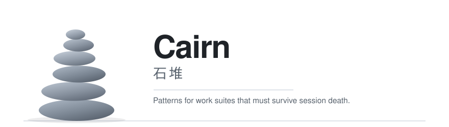

<p align="center">
  <picture>
    <source media="(prefers-color-scheme: dark)" srcset="assets/cairn-dark.svg">
    
  </picture>
</p>

# Cairn

**A pattern language for keeping multi-agent work recoverable across sessions, tools, and machines.**

<p>
  <a href="LICENSE"></a>
  
</p>

[Start with the diagnostic](docs/02-signs-you-need-this.md) · [Browse failure modes](docs/04-failure-modes.md) · [Copy a handoff](templates/handoff-frontmatter.md) · [中文](README.zh-CN.md)

## Why Cairn

Long-running work often succeeds inside one session and fails at the boundary to the next one:

- the real state lives in conversation history and human memory;
- “done” is declared before the required artifact exists;
- several files disagree about what is current;
- approvals disappear with the chat that carried them;
- switching tools or machines means explaining the project again.

Cairn treats these as architecture failures, not documentation accidents. It gives you a shared vocabulary, a catalog of recurring failures, and protocol shapes that you can implement with your own roles, files, and tools.

> Cairn is not a runtime or orchestration framework. It is the blueprint you design your own working system against.

If you know **The Twelve-Factor App**: that document runs no application; it only states the qualities an application should have. Cairn does the same thing, with web apps swapped out for multi-agent, multi-session work.

## Start in 10 minutes

1. **Run the diagnostic.** Check the symptoms in [Signs you need Cairn](docs/02-signs-you-need-this.md).
2. **Pick one expensive failure.** Find its root cause and repair direction in the [failure-mode catalog](docs/04-failure-modes.md).
3. **Adopt one shared artifact.** Start with the [handoff template](templates/handoff-frontmatter.md) or the cold-read pattern in [PS-02](docs/07-protocol-skeletons.md#ps-02--cold-read-surface-current-file).
4. **Test a real transition.** Ask a new session to recover state without a human reconstruction.
5. **Add only what the failure justifies.** Cairn is meant to be adopted incrementally.

See [First adoption](examples/first-adoption.md) for a small end-to-end example.

## What you get

| Surface | What it provides | Use it when… |
|---|---|---|
| [Diagnostic](docs/02-signs-you-need-this.md) | 16 observable continuity signals | you are unsure whether the problem is local friction or structural |
| [Glossary](docs/03-glossary.md) | 9 status words, 6 critical distinctions, 4 evidence tiers | different people mean different things by “done,” “blocked,” or “verified” |
| [Failure modes](docs/04-failure-modes.md) | 12 triggers, symptoms, root causes, and repair directions | you need to name the failure before redesigning the workflow |
| [Protocol skeletons](docs/07-protocol-skeletons.md) | handoff, cold-read, decision queue, role contract, scoped reconsideration | a durable artifact needs a domain-neutral shape |
| [Handoff template](templates/handoff-frontmatter.md) | copyable frontmatter, body outline, detached-anchor verification | work must cross a session, tool, machine, or audience boundary |
| [Worked example](examples/first-adoption.md) | one incremental adoption from chat-only state to a verifiable cold start | you want to see how the pieces fit without implementing everything |

## The core idea

A raft-era workflow keeps its working truth in the room:

```text
session → conversation state → session ends → human reconstruction
```

A recoverable workflow moves load-bearing truth into inspectable artifacts:

```text
session → durable evidence + derived current view → verification → next session
```

Cairn does not prescribe the file format, toolchain, or role names. It requires the distinctions that make independent recovery possible:

- dispatch is not implementation;
- presence is not authority;
- workflow completion is not result validity;
- a message is transport, not the permanent record;
- printed values are not verification unless mismatches fail closed.

## Project status

Cairn is an early public preview. The usable core is available now; the wider guide is still growing.

| Available now | Planned next |
|---|---|
| diagnostic, glossary, failure modes, protocol skeletons | introductory definition and symptom guide |
| handoff template and first-adoption example | record-discipline and anti-pattern guides |
| contribution and privacy guidance | additional templates and implementation checklist |

The preview label means the catalog may change. It does not mean that primary navigation points to empty placeholders.

## Documentation

- [Signs you need Cairn](docs/02-signs-you-need-this.md)
- [Shared vocabulary](docs/03-glossary.md)
- [Failure-mode catalog](docs/04-failure-modes.md)
- [Protocol skeletons](docs/07-protocol-skeletons.md)
- [Handoff template](templates/handoff-frontmatter.md)
- [First adoption example](examples/first-adoption.md)

## What Cairn is not

- Not an agent runtime, workflow engine, or prompt framework.
- Not a universal process that every project should adopt in full.
- Not an authority on your role names, storage formats, or technical stack.
- Not related to the Raft consensus algorithm.

## Contributing

Issues and pull requests are welcome. Start with [CONTRIBUTING.md](CONTRIBUTING.md), especially the privacy and provenance rules for public examples, or [open an issue](https://github.com/LolerPanda/cairn/issues/new) with a repeatable failure class.

Good first contributions include clearer fictional examples, accessibility fixes, broken-link repairs, and reports of pattern collisions. Please describe repeatable failure classes rather than publishing private incident details.

## License

[MIT](LICENSE) © 2026 LolerPanda.
